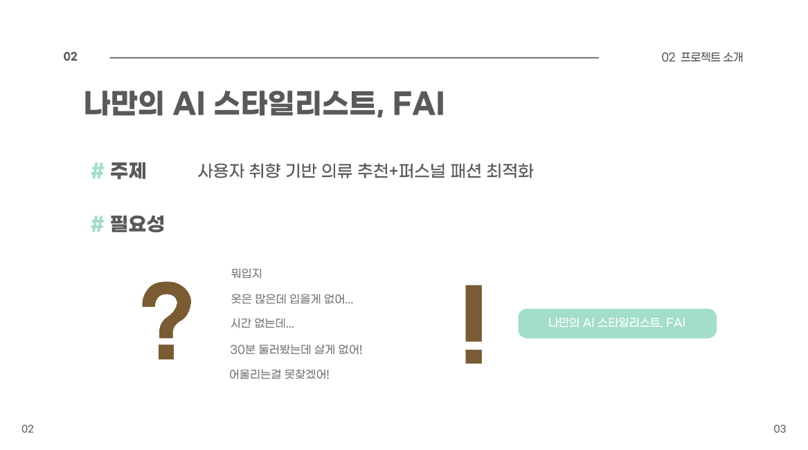
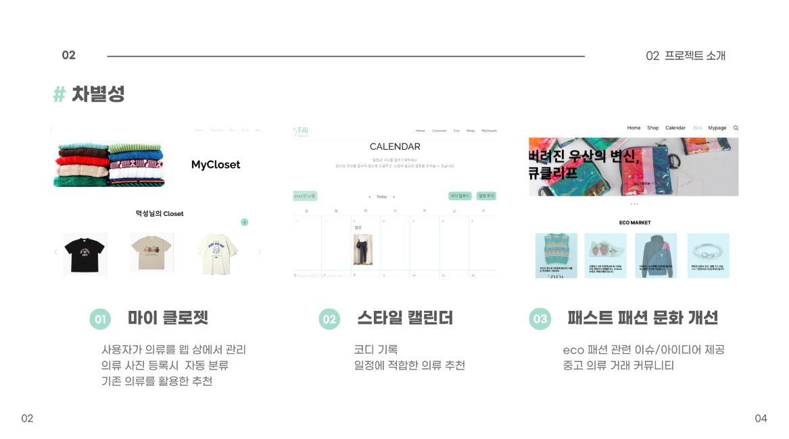
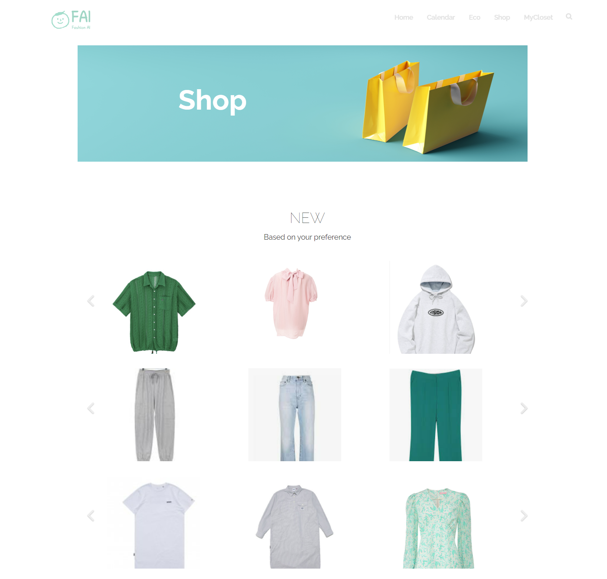

# 나만의 AI 스타일리스트, FAI

 

## 프로젝트 소개

 

## 사용 기술 및 스택
<li> Design : Figma </li>
<li> Front-end : Javascript, CSS(SCSS) </li>
<li> Back-end : MySQL, Node.js </li>
<li> AI : Python(CNN, Inception), Flask </li>
<li> 기타 : Crawling </li>

 

## 아키텍쳐

## UI

