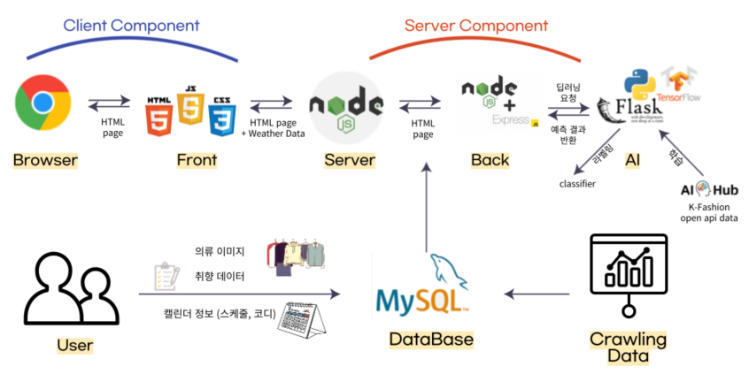
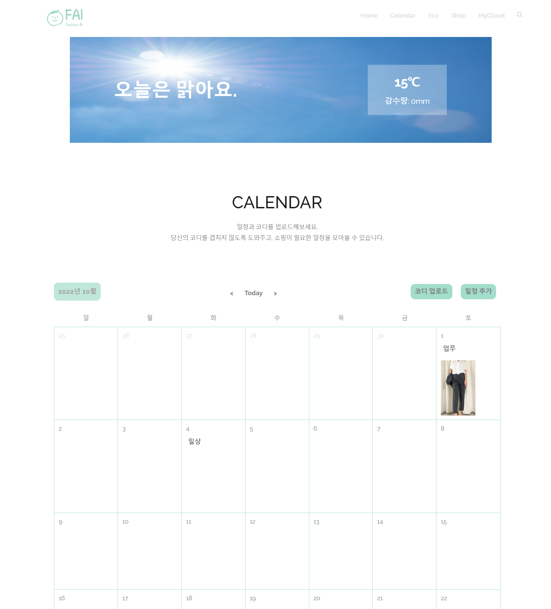
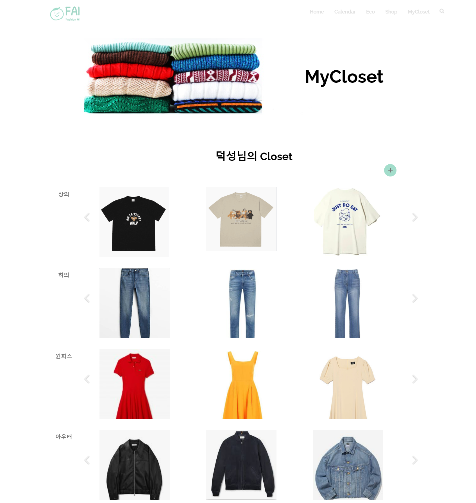
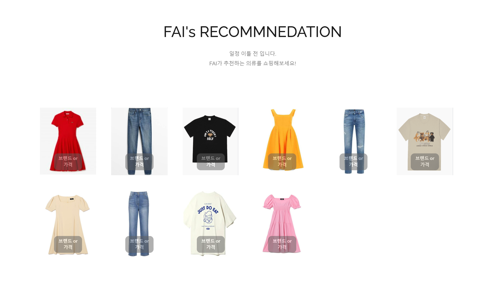

# Personal_AI_Stylist

 

## 프로젝트 소개

## 개발 환경 & 스택

- Design : figma
- Front-end : Javascript, CSS(SCSS)
- Back-end : Node, MySQL
- AI : Python(CNN, Inception), Flask
- 기타 : Web Crawling

 

## 아키텍쳐

 

## 주요 기능 / UI

